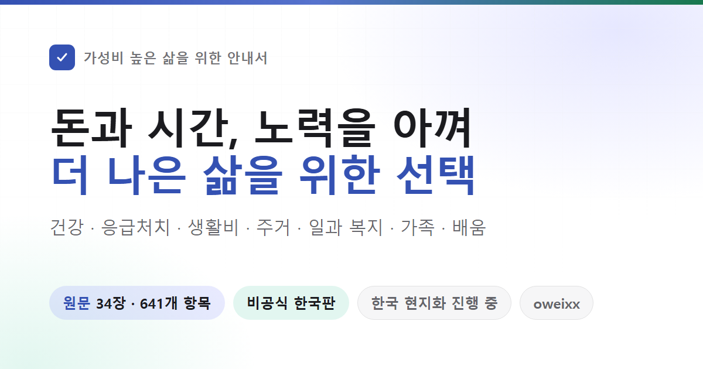

# 가성비 높은 삶을 위한 안내서 · 한국판



**현재 일부 내용을 작성한 현지화 초안입니다. 원문 전체의 번역·검수는 진행 중입니다.**

중국의 제도·가격·사회적 사례를 대한민국에서 사용할 수 있는 안내로 다시 쓰는 프로젝트입니다. 위안화를 원화로 환산하는 데 그치지 않고, 지원 대상·신청 창구·법적 조건·예외를 한국의 공식 자료로 다시 확인합니다. 해외 연구의 대상과 한계를 한국인의 효과로 바꾸지 않습니다.

- 한국판 웹사이트: **[oweixx.github.io/HowToLiveBetter-KR](https://oweixx.github.io/HowToLiveBetter-KR/)**
- 오프라인으로 읽기: 저장소를 내려받아 [index.html](index.html)을 브라우저로 열면 됩니다. 별도 설치 없이 검색할 수 있습니다.
- 한국어 본문: [ko/book](ko/book)
- 전체 34장 편집 범위: [ko/editorial.json](ko/editorial.json)
- 원문 641개 항목의 검토 상태: [ko/source-map.json](ko/source-map.json)
- 편집 기준과 이미지 처리: [ko/LOCALIZATION.md](ko/LOCALIZATION.md)

한국판 항목은 여러 원문 항목을 합치거나 한국 제도로 대체할 수 있습니다. 한국판 초안 수는 번역 완료한 원문 항목 수가 아닙니다. `source-map.json`의 `pending`은 아직 전체 대응 검토가 끝나지 않았다는 뜻입니다. 작성된 초안도 내용 검수가 필요합니다.

## 현재 작성한 내용

| 장 | 한국판 초안 | 주요 변경 |
| --- | --- | --- |
| 3 | [에너지와 집중력 지키기](ko/book/03.md) | 원문 25개 항목 대조, 수면·업무·감정·한국 상담과 민원 창구 |
| 4 | [시간 낭비 줄이기](ko/book/04.md) | 원문 18개 항목 대조, 중국 생활시간을 개인 기록·원화 예시로 변경 |
| 5 | [돈을 지키는 소비와 금융](ko/book/05.md) | 예금보호, 채무 상담, 원화 계산 예시 |
| 7 | [소득이 끊겼을 때](ko/book/07.md) | 원문 21개 항목 대조, 구직·생계·장애·주거·보험·채무·재기 지원 |
| 11 | [개발자와 기술자가 확인할 법적 경계](ko/book/11.md) | 원문 17개 항목 대조, 접근 권한·외주·경업금지·오픈소스·개인정보·AI |
| 13 | [응급상황에서 먼저 할 일](ko/book/13.md) | 119, 성인 심폐소생술, 뇌졸중·심근경색 초기 대응 |
| 14 | [계정과 개인정보 보호](ko/book/14.md) | 원문 9개 항목 대조, 국내 통신·카드·개인정보 권리 안내 |
| 15 | [전세·월세와 내 집 마련](ko/book/15.md) | 원문 9개 항목 대조, 임대차·중개·주거 안전·농촌 주택 |
| 16 | [만성질환과 함께 살아가기](ko/book/16.md) | 원문 9개 항목 대조, 산정특례·동네의원 관리·당뇨 합병증·결석·통풍 |
| 17 | [부모님과 노후 돌봄](ko/book/17.md) | 원문 8개 항목 대조, 임의후견·유언·주택연금·장기요양·욕창 예방 |
| 18 | [아이를 키우는 돈과 시간](ko/book/18.md) | 원문 6개 항목 대조, 부모급여·출산휴가·돌봄 분담과 예산 |
| 19 | [재직·퇴사·산재](ko/book/19.md) | 한국 최저임금, 퇴직금, 임금체불 |
| 20 | [신생아와 영아 돌보기](ko/book/20.md) | 원문 12개 항목 대조, 안전 수면·국내 예방접종·수유·발열·육아용품 |
| 21 | [해외여행과 안전](ko/book/21.md) | 원문 11개 항목 대조, 한국 여권·영사 지원·국제운전면허·해외 결제 |
| 22 | [휴식과 여가](ko/book/22.md) | 원문 11개 항목 대조, 국내 시설·분쟁·약물 상담, 해외 연구의 수치와 한계 |
| 24 | [병원 이용과 의료비](ko/book/24.md) | 진료 절차, 응급실, 재난적의료비 |
| 25 | [가족이 사망한 뒤의 절차](ko/book/25.md) | 원문 10개 항목 대조, 사망신고·장례비·재산과 채무 조회·유족 급여 |
| 26 | [웹사이트와 플랫폼 운영](ko/book/26.md) | 원문 11개 항목 대조, 국내 신고·정산·게시물·미성년자·국외 이전 |
| 27 | [임신부터 출산·출생신고까지](ko/book/27.md) | 원문 16개 항목 대조, 산전·산후 진료·국민행복카드·신생아 검사·출생신고 |
| 28 | [외모와 체중 관리](ko/book/28.md) | 원문 8개 항목 대조, 섭식장애·시술·비만약·호르몬의 위험과 국내 확인 절차 |
| 29 | [큰 상실과 위기를 겪은 뒤의 생활](ko/book/29.md) | 원문 13개 항목 대조, 사별·중병·실직·돌봄·국내 위기와 채무 상담 |
| 30 | [학교에 다니는 아이의 건강과 생활](ko/book/30.md) | 원문 15개 항목 대조, 학교폭력·근시·검진·학적·수면·게임·상담 |
| 32 | [해외 유학의 체류·취업·보험·학위 확인](ko/book/32.md) | 원문 10개 항목 대조, 한국의 학위 확인과 미·영·캐나다·호주 조건 |
| 34 | [상비약을 안전하게 쓰기](ko/book/34.md) | 원문 9개 항목 대조, 중복 성분·소아·임신부·위장약·설사와 두통 |

다른 장의 계획은 웹 화면의 전체 목차에서도 확인할 수 있습니다. 의료·법률·복지 항목은 출처와 적용 조건을 함께 읽어 주세요. 확인일은 자료를 확인한 날짜이며 모든 상황에서 같은 결과를 보장하는 날짜가 아닙니다.

## 원작과 이용 조건

원작은 [eternity4719의 《高性价比人生指南》](https://github.com/eternity4719/HowToLiveBetter)입니다. 한국판 기준 원문은 [`d63794d`](https://github.com/eternity4719/HowToLiveBetter/tree/d63794d5dba477ca42b3309a5ae5b396f330c35f)입니다. 원래 [중국어 README](README.zh-CN.md)와 `book/`, `docs/`는 원문 비교용으로 보존합니다.

한국어 번역·한국 제도에 맞춘 재구성·한국판 디자인은 **oweixx / HowToLiveBetter-KR**에서 관리합니다. 비공식 파생판이며 원작자의 한국판 검수나 보증을 뜻하지 않습니다. 한국판의 오류는 이 저장소의 이슈로 알려 주세요.

- 본문과 한국판 이미지: [CC BY 4.0](https://creativecommons.org/licenses/by/4.0/deed.ko), [라이선스 전문](LICENSE)
- 코드: [MIT](LICENSE-CODE), 기존 저작권 고지 유지

재배포할 때 원작자와 한국판 출처, 라이선스 링크, 수정 사실을 표시해야 합니다. 원작자의 광고·위챗 후원 QR은 한국판 화면에 사용하지 않습니다.

## 개발과 검증

Python 3으로 외부 패키지 없이 빌드합니다.

```sh
python tools/build-korean.py
python tools/build-korean.py --check
python -m unittest discover -s tools/korean-tests
```

원작의 화면 구조를 유지합니다. 왼쪽 장별 목차, 비용·효과·근거 필터, 항목 카드, 출처 펼치기, 다크 모드와 모바일 메뉴를 한국어로 제공합니다. `ko/book/*.md`와 `ko/site-template.html`을 수정한 뒤 빌드하면 `index.html`과 원문 검토 목록을 갱신합니다. 원문이 바뀌면 해당 항목의 검토 상태를 다시 `pending`으로 돌립니다. 사람의 검토 기록은 원문이 같을 때 유지합니다. 검색 화면은 네트워크 연결 없이 읽을 수 있지만 외부 출처 링크에는 인터넷 연결이 필요합니다.

`tools/restore-korean-layout.py`는 보존된 원작 HTML에서 한국어 화면 틀을 재생성합니다. 편집 초안에 비용·효과 등급을 임의로 부여하지 않으며, 근거의 A/B/C 등급과 한국 제도 확인을 구분합니다. 아직 본문을 쓰지 않은 장은 ‘대기’로 표시합니다.

표지 원본은 [ko/cover.html](ko/cover.html)입니다. 1200×630, 배율 1로 캡처해 `og.png`와 `ko/og.png`를 함께 갱신합니다. 중국어 원문의 통계·전자책 스크립트는 한국판 배포에 사용하지 않습니다.

`korean-edition` 브랜치에 푸시하면 GitHub Actions가 빌드와 검사를 수행하고, 통과한 한국판 화면을 GitHub Pages에 배포합니다. 배포 파일은 한국판 HTML, 공유 이미지와 라이선스 파일로 제한합니다.
